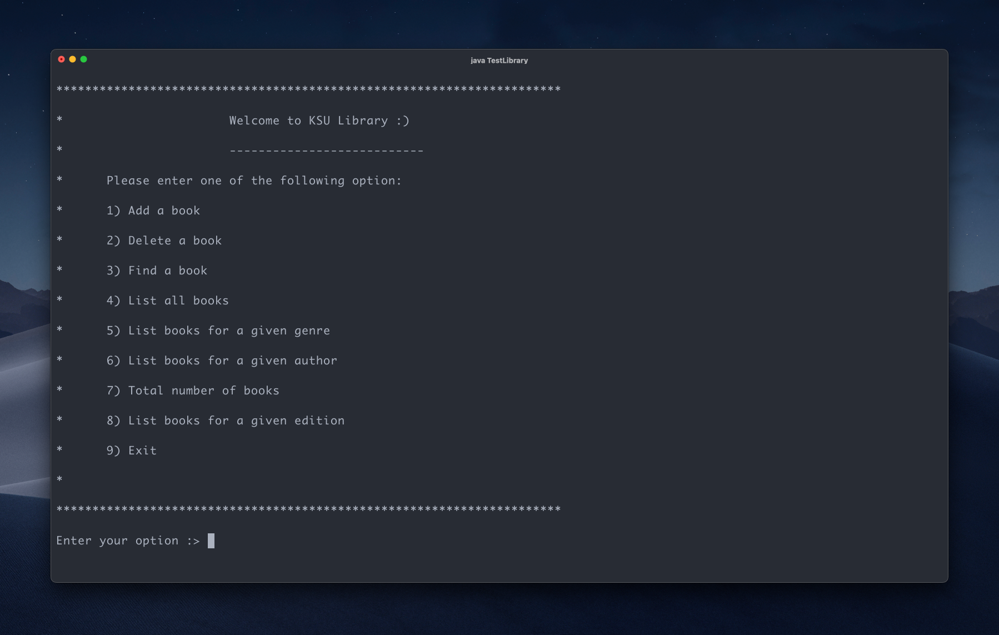

# Library

CLI Program for a system to manage the books in a library.

## Problem Description

You need to write a program for a system to manage the books in a library. Your system should be able to add books to a
library archive, retrieve a book by ISBN, delete a book given ISBN and return the total number of books that have the
same author. The program should enable a library clerk to complete the following tasks:

-   Add a book to the collection of books in the library.
-   Delete a book from the collection of books in the library.
-   Find the information about a book given its ISBN.
-   Given author name, return the total number of books for that author.
-   Print all the books.
-   Print all the books with the same genre (type of book).
-   Print all the books with the same edition

## Assumptions

-   Book ISBN is unique; no two books can have the same ISBN.
-   ISBN must be checked and validated using a specific formula before adding the book to the archive (see method
    verifyISBN).
-   When adding a book, a reference code is generated to make the classifying procedure easier. A book reference code
    for the library is taken from the book title and the author name (see method generateReference).
-   There is a counter for the number of books (see numOfBooks) that will be incremented whenever a book is added
    successfully and decremented when a book is deleted successfully.

## Sample Run

<details>

```text
**********************************************************************
*                       Welcome to KSU Library :)
*                       ---------------------------
*      Please enter one of the following options:
*      1) Add a book
*      2) Delete a book
*      3) Find a book
*      4) List all books
*      5) List books for a given genre
*      6) Number of books for a given author
*      7) Total number of books
*      8) List books for a given edition
*      9) Exit
*
**********************************************************************
Enter your option :> 1
Please, enter the book details #ISBN, author, title,genre,publisher and edition :0200
stefen
java
programming
macgrowhill
1
The book has been added.
**********************************************************************
*                       Welcome to KSU Library :)
*                       ---------------------------
*      Please enter one of the following options:
*      1) Add a book
*      2) Delete a book
*      3) Find a book
*      4) List all books
*      5) List books for a given genre
*      6) Number of books for a given author
*      7) Total number of books
*      8) List books for a given edition
*      9) Exit
*
**********************************************************************
Enter your option :> 3
Enter ISBN0200
0
**********************************************************************
*                       Welcome to KSU Library :)
*                       ---------------------------
*      Please enter one of the following options:
*      1) Add a book
*      2) Delete a book
*      3) Find a book
*      4) List all books
*      5) List books for a given genre
*      6) Number of books for a given author
*      7) Total number of books
*      8) List books for a given edition
*      9) Exit
*
**********************************************************************
Enter your option :> 4
Title :java
Author :stefen
ISBN :200 - Reference Code ST-PR
Genre :programming
publisher :macgrowhill
edition :1
**********************************************************************
*                       Welcome to KSU Library :)
*                       ---------------------------
*      Please enter one of the following options:
*      1) Add a book
*      2) Delete a book
*      3) Find a book
*      4) List all books
*      5) List books for a given genre
*      6) Number of books for a given author
*      7) Total number of books
*      8) List books for a given edition
*      9) Exit
*
**********************************************************************
Enter your option :> 5
Enter genre: programming
Title :java
Author :stefen
ISBN :200 - Reference Code ST-PR
Genre :programming
publisher :macgrowhill
edition :1
**********************************************************************
*                       Welcome to KSU Library :)
*                       ---------------------------
*      Please enter one of the following options:
*      1) Add a book
*      2) Delete a book
*      3) Find a book
*      4) List all books
*      5) List books for a given genre
*      6) Number of books for a given author
*      7) Total number of books
*      8) List books for a given edition
*      9) Exit
*
**********************************************************************
Enter your option :> 7
1
**********************************************************************
*                       Welcome to KSU Library :)
*                       ---------------------------
*      Please enter one of the following options:
*      1) Add a book
*      2) Delete a book
*      3) Find a book
*      4) List all books
*      5) List books for a given genre
*      6) Number of books for a given author
*      7) Total number of books
*      8) List books for a given edition
*      9) Exit
*
**********************************************************************
Enter your option :> 8
Enter edition: 1
Title :java
Author :stefen
ISBN :200 - Reference Code ST-PR
Genre :programming
publisher :macgrowhill
edition :1
**********************************************************************
*                       Welcome to KSU Library :)
*                       ---------------------------
*      Please enter one of the following options:
*      1) Add a book
*      2) Delete a book
*      3) Find a book
*      4) List all books
*      5) List books for a given genre
*      6) Number of books for a given author
*      7) Total number of books
*      8) List books for a given edition
*      9) Exit
*
**********************************************************************
Enter your option :> 2
Enter ISBN: 0200
The book has been deleted.
**********************************************************************
*                       Welcome to KSU Library :)
*                       ---------------------------
*      Please enter one of the following options:
*      1) Add a book
*      2) Delete a book
*      3) Find a book
*      4) List all books
*      5) List books for a given genre
*      6) Number of books for a given author
*      7) Total number of books
*      8) List books for a given edition
*      9) Exit
*
**********************************************************************
Enter your option :> 9
Thanks. Goodbye!
```

</details>

## Requirements

-   [Java](https://www.oracle.com/java/technologies/downloads)

## Installation

```shell
$ git clone https://github.com/devmoath/university-projects.git
```

## Usage

```shell
$ cd university-projects/CSC-111/library/src
$ javac TestLibrary.java
$ java TestLibrary
```


