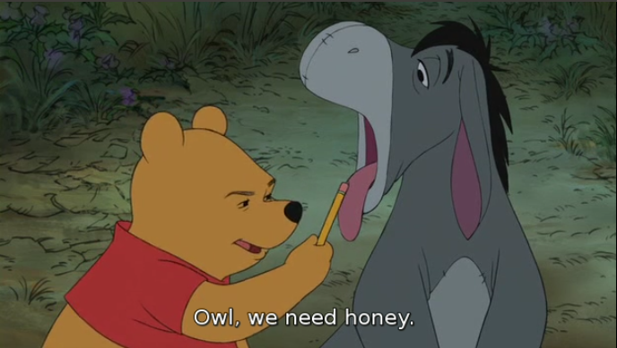

# Manipulating Subtitles

Developing an Application for Manipulating Subtitles.

## Introduction

Subtitles are captions displayed at the bottom of a cinema or television screen that translate or transcribe the
dialogue or events taking place in the video (see [Figure 1](#figure-1) for an example). Subtitles can be hard-coded
into the video stream or come as a separate file. The goal of this project is to develop an application for manipulating
subtitle files.

Subtitles are captions displayed at the bottom of a cinema or television screen that translate or transcribe the
dialogue or events taking place in the video (see Figure 1 for an example). Subtitles can be hard-coded into the video
stream or come as a separate file. The goal of this project is to develop an application for manipulating subtitle
files.

<figure align="center" id='figure-1'>
    
    <figcaption>Figure 1</figcaption>
</figure>

## Data Format

There are many file formats for representing subtitles, but arguably the simplest of these formats is the SubRip format,
also known as SRT format because of its file extension. An SRT file is a text file consisting of a sequence of
subtitles, each having the following structure:

-   A sequential number which starts at 1.
-   The start and end times when the subtitle should appear on screen. The time is specified in the format: HH:MM:SS,ms
    (the last field is an integer value in milliseconds). The display intervals of subtitles must not overlap.
-   The text of the subtitle. Line breaks are allowed.
-   An empty line indicating the start of a new subtitle (the last subtitle is not followed by an empty line).

The following shows sample subtitles:

```text
140
00:08:40,103 --> 00:08:41,813
Just as I suspected.
141
00:08:41,897 --> 00:08:45,108
Owl, we need honey.
```

## Implementation Requirements

In this phase, you are required to implement the following classes and interfaces (This specification must under no
circumstances be modified):

```java
// Interface representing time
public interface Time {
    int getHH();

    int getMM();

    int getSS();

    int getMS();

    void setHH(int hh);

    void setMM(int mm);

    void setSS(int ss);

    void setMS(int ms);
}

// This interface represents a single subtitle.
public interface Subtitle {
    // Return the start time of the Subtitle.
    Time getStartTime();

    // Return the end time of the Subtitle.
    Time getEndTime();

    // Return the subtitle text.
    String getText();

    // Set the start time of the Subtitle.
    void setStartTime(Time startTime);

    // Set the end time of the Subtitle.
    void setEndTime(Time endTime);

    // Set the subtitle teat.
    void setText(String text);
}

// This interface represents a subtitle sequence.
public interface SubtitleSeq {
    // Add a subtitle.
    void addSubtitle(Subtitle st);

    // Return all subtitles in their chronological order.
    List<Subtitle> getSubtitles();

    // Return the subtitle displayed at the specified time, null if no
    // subtitle is displayed.
    Subtitle getSubtitle(Time time);

    // Return, in chronological order, all subtitles displayed between the
    // specified start and end times. The first element of this list is the
    // subtitle of which the display interval contains or otherwise comes
    // Immediately after startTime. The last element of this list is the
    // subtitle of which the display interval contains or otherwise comes
    // immediately before endTime.
    List<Subtitle> getSubtitles(Time startTime, Time endTime);

    // Return, in chronological order, all subtitles containing str as a
    // sub-string in their text.
    List<Subtitle> getSubtitles(String str);

    // Remove all subtitles containing str as a sub-string in their text.
    void remove(String str);

    // Replace str1 with str2 in all subtitles.
    void replace(String str1, String str2);

    // Shift the subtitles by offsetting their start/end times with the specified
    // offset (in milliseconds). The value offset can be positive or negative.
    // Negative time is not allowed and must be replaced with 0. If the end time
    // becomes 0, the subtitle must be removed.
    void shift(int offset);

    // Cut all subtitles between the specified start and end times. The first
    // subtitle to be removed is the one for which the display interval contains
    // or otherwise comes immediately after startTime. The last subtitle to be
    // removed is the one for which the display interval contains or otherwise
    // comes immediately before endTime. The start and end times of all
    // subtitles must be adjusted to reflect the new time.
    void cut(Time startTime, Time endTime);
}

public class SubtitleSeqFactory {

    // Return an empty subtitles sequence
    public static SubtitleSeq getSubtitleSeq() {}

    // Load a subtitle sequence from an SRT file. If the file does not exist or
    // is corrupted (incorrect format), null ts returned.
    public static SubtitleSeq loadSubtitleSeq(String fileName) {}
}

```

## Requirements

-   [Java](https://www.oracle.com/java/technologies/downloads)

## Installation

```shell
$ git clone https://github.com/devmoath/university-projects.git
```

## Usage

> WIP
