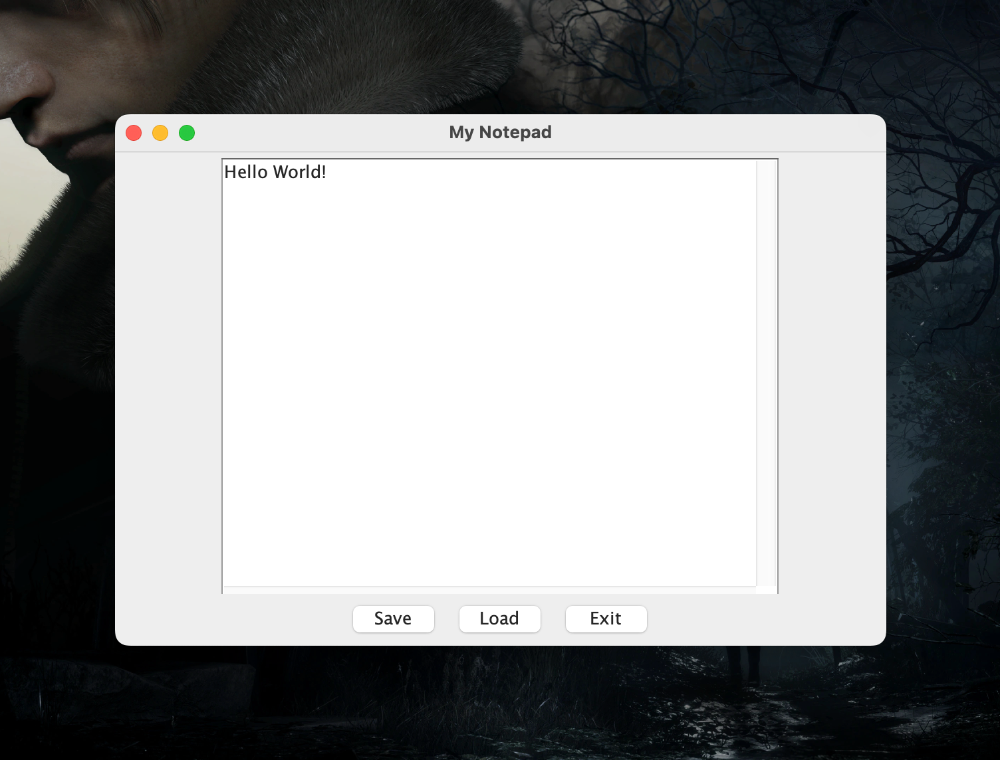

# Notepad

Application look like the Notepad in the Windows OS

## Requirements

-   [Java](https://www.oracle.com/java/technologies/downloads)

## Installation

```shell
$ git clone https://github.com/devmoath/university-projects.git
```

## Usage

```shell
$ cd university-projects/IS-224/notepad/src
$ javac MyNotepad.java
$ java MyNotepad
```


