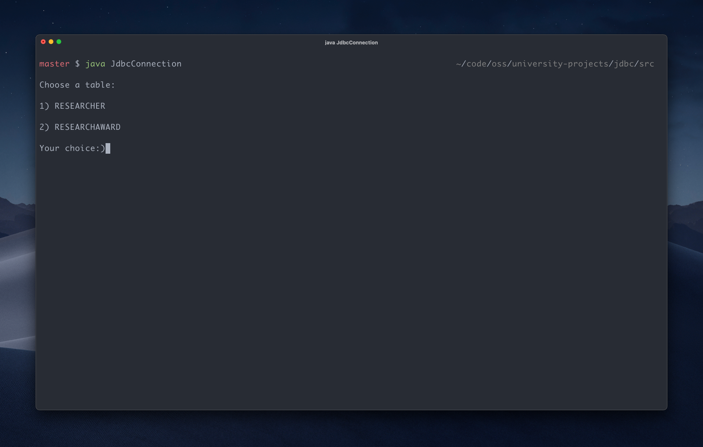

# Java Database Connectivity (JDBC)

## Requirements

-   [Java](https://www.oracle.com/java/technologies/downloads)

## Installation

```shell
$ git clone https://github.com/devmoath/university-projects.git
```

## Usage

```shell
$ cd university-projects/IS-230/jdbc/src
$ javac JdbcConnection.java
$ java JdbcConnection
```


