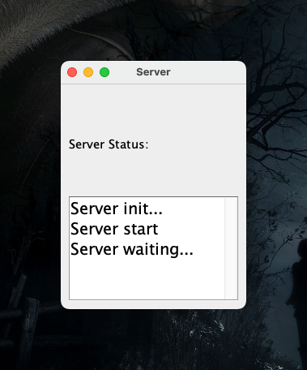
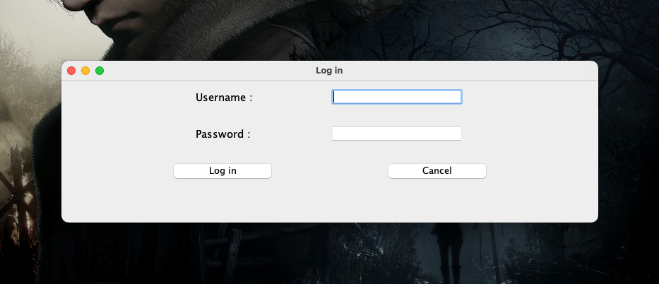
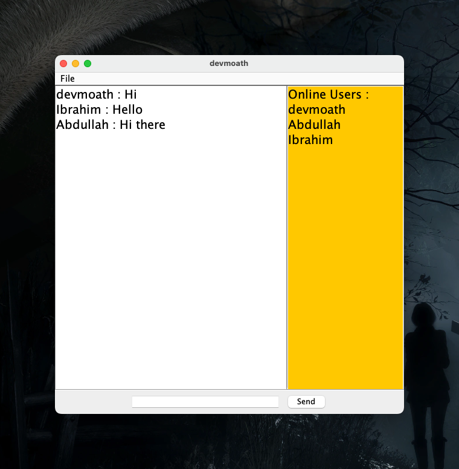

# Chat Application

Simple chat application using Java Socket.

## Requirements

-   [Java](https://www.oracle.com/java/technologies/downloads)

## Installation

```shell
$ git clone https://github.com/devmoath/university-projects.git
```

## Usage

```shell
$ cd university-projects/IS-370/chat-application/src
$ javac Server.java && java Server
$ javac Client.java && java Client
```






