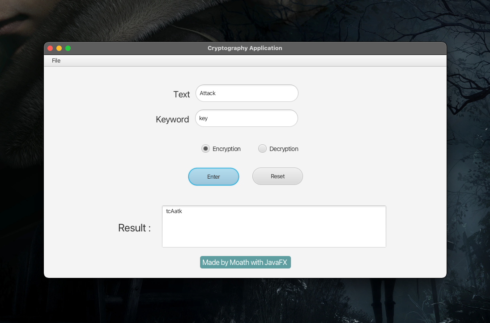

# Cryptography Application

Defense Application Using Columnar Keyword Transposition Algorithm.

## Introduction

What’s Columnar Keyword Transposition ? In a columnar transposition, the message is written out in rows of a fixed
length, and then read out again column by column, and the columns are chosen in some scrambled order. Both the width of
the rows and the permutation of the columns are usually defined by a keyword. For example, the keyword `ZEBRAS` is of
length 6 (so the rows are of length 6), and the permutation is defined by the alphabetical order of the letters in the
keyword. In this case, the order would be `6 3 2 4 1 5`. In a regular columnar transposition cipher, any spare spaces
are filled with `nulls`; in an irregular columnar transposition cipher, the spaces are left blank. Finally, the message
is read off in columns, in the order specified by the keyword. For example, suppose we use the keyword `ZEBRAS` and the
message `WE ARE DISCOVERED. FLEE AT ONCE.` In a regular columnar transposition, we write this into the grid as follows:

| 6   | 3   | 2   | 4   | 1   | 5   |
| --- | --- | --- | --- | --- | --- |
| W   | E   | A   | R   | E   | D   |
| I   | S   | C   | O   | V   | E   |
| R   | E   | D   | F   | L   | E   |
| E   | A   | T   | O   | N   | C   |
| E   | Q   | K   | J   | E   | U   |

providing five nulls (QKJEU), these letters can be randomly selected as they just fill out the incomplete columns and
are not part of the message. The ciphertext is then read off as:

```text
EVLNE ACDTK ESEAQ ROFOJ DEECU WIREE
```

In the irregular case, the columns are not completed by nulls:

| 6   | 3   | 2   | 4   | 1   | 5   |
| --- | --- | --- | --- | --- | --- |
| W   | E   | A   | R   | E   | D   |
| I   | S   | C   | O   | V   | E   |
| R   | E   | D   | F   | L   | E   |
| E   | A   | T   | O   | N   | C   |
| E   |

This results in the following ciphertext:

```text
EVLNA CDTES EAROF ODEEC WIREE
```

To decipher it, the recipient has to work out the column lengths by dividing the message length by the key length. Then
he can write the message out in columns again, then re-order the columns by reforming the key word. In a variation, the
message is blocked into segments that are the key length long and to each segment the same permutation (given by the
key) is applied. This is equivalent to a columnar transposition where the read-out is by rows instead of columns.
Columnar transposition continued to be used for serious purposes as a component of more complex ciphers at least into
the 1950s.

## Requirements

-   [Java](https://www.oracle.com/java/technologies/downloads)
-   [JavaFX](https://gluonhq.com/products/javafx)

## Installation

```shell
$ git clone https://github.com/devmoath/university-projects.git
```

## Usage

```shell
$ cd university-projects/IS-493/cryptography-application/src
$ javac --module-path $PATH_TO_JAVA_FX_SDK --add-modules javafx.controls --add-modules javafx.fxml Main.java
$ java --module-path $PATH_TO_JAVA_FX_SDK --add-modules javafx.controls --add-modules javafx.fxml Main
```


