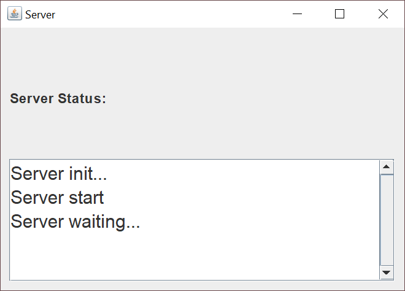
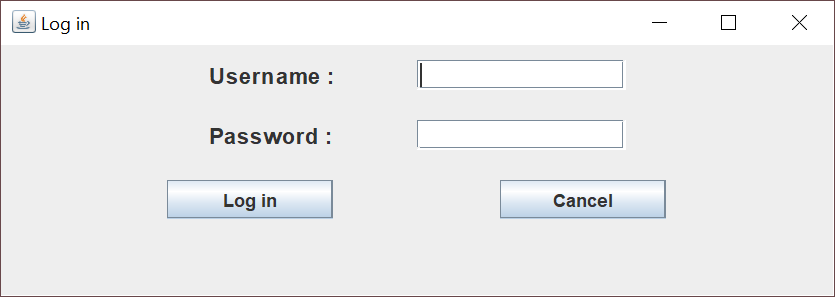
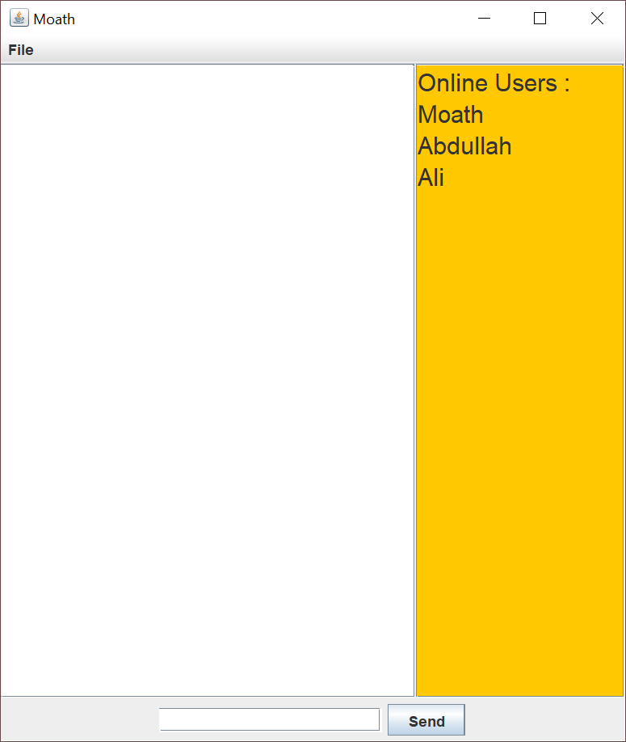
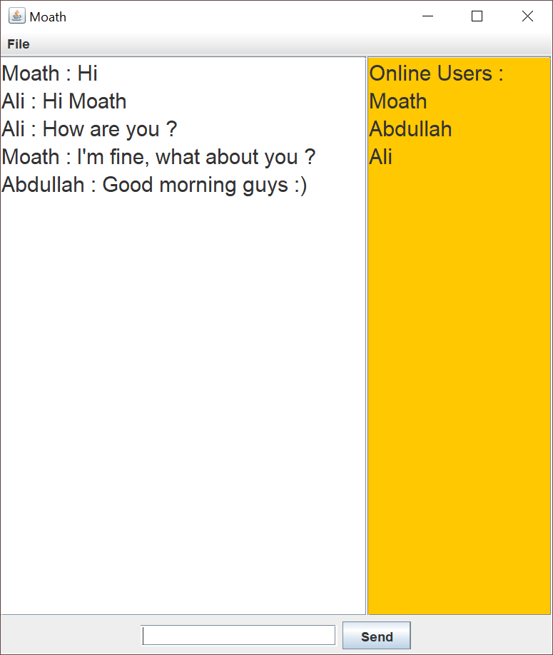

# Chat Application

Simple chat app with java socket

## Requirements
* [JDK 8 or newer](https://www.oracle.com/technetwork/java/javase/downloads/jdk8-downloads-2133151.html)
* IDE e.g. [IntelliJ IDEA](https://www.jetbrains.com/idea/) (Optional) 

## Installation
* Download the repository Or clone it using [Git](https://git-scm.com/) clone

    ```
    $ git clone https://github.com/DevMoath/Chat-Application.git
    ```    
  
## How To Use
* Go to ***src*** folder  
    ```
    $ cd Chat-Application/src
    ```
    
* run ***Server.java***
    ```
    $ javac Server.java
    $ java Server
    ```
* run ***Client.java***, (_you can run more than one client_)
    ```
    $ javac Client.java
    $ java Client
    ```
## Screenshots
* Server Frame for server status


* Client Login Frame


* Chat Frame


* Chat Frame (real example)

