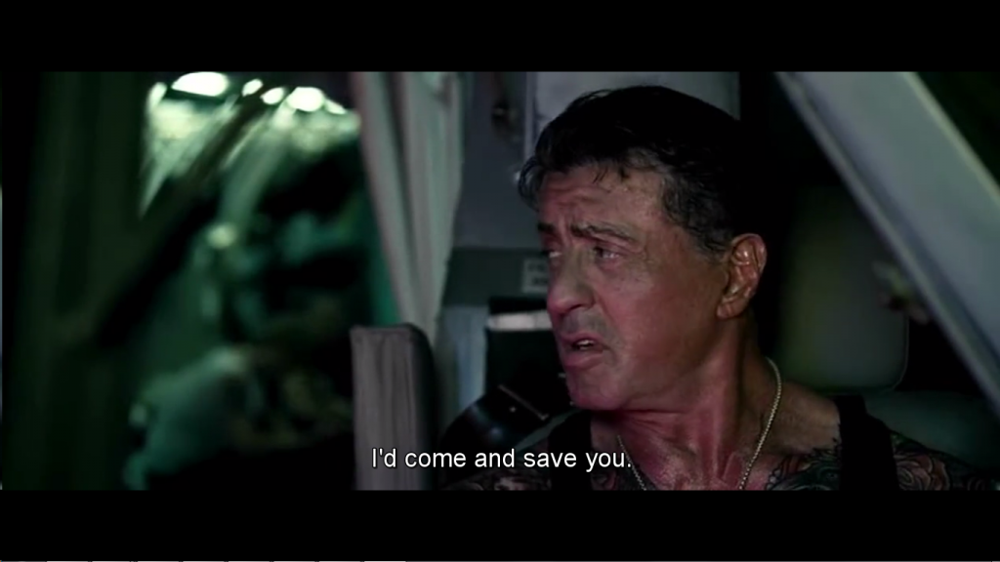

## Introduction

Subtitles are captions displayed at the bottom of a cinema or television screen that translate or transcribe the dialogue or events taking place in the video (see Figure 1 for
an example). Subtitles can be hard-coded into the video stream or come as a separate file. The goal of this project is to develop an application for manipulating subtitle files.

<p align="center">
  
</p>

## Data Format
There are many file formats for representing subtitles, but arguably the simplest of these formats is the SubRip format, also known as SRT format because of its file extension.
An SRT file is a text file consisting of a sequence of subtitles, each having the following structure:
<ol>
<li>A sequential number which starts at 1.</li>
<li>The start and end times when the subtitle should appear on screen. The time is specified in the format: HH:MM:SS,ms (the last field is an integer value in milliseconds). The display intervals of subtitles must not overlap.</li>
<li>The text of the subtitle. Line breaks are allowed.</li>
<li>An empty line indicating the start of a new subtitle (the last subtitle is not followed by an empty line).</li>
</ol>

The following shows sample subtitles:
```
140
00:08:40,103 --> 00:08:41,813
Just as I suspected.
141
00:08:41,897 --> 00:08:45,108
Owl, we need honey.
```
